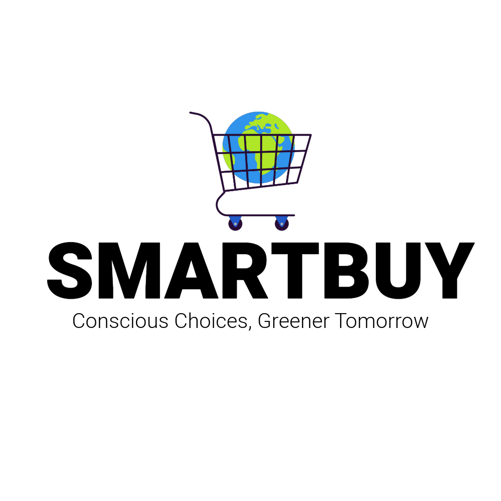

 

  

  <h3 align="center">A Virtual Reality application for climate change education</h3>

  

     
    <a href="SmartBuy_Report.pdf"><strong>-> Learn more about Climate Change and VR <-</strong></a>
     
     
    <a href="https://github.com/zibodsun/BravoTeam/releases">Download Demo</a>
    ·
    <a href="https://github.com/zibodsun/BravoTeam/issues">Report Bug</a>
    ·
    <a href="https://github.com/zibodsun/BravoTeam/issues">Request Feature</a>
  

# The Project


 
We developed this grocery shopping simulation with the goal of spreading more awareness about bad practices in the production of common shopping items, which cause negative environmental effects. We aim to provide facts about the production process of some products/ingredients in a memorable way, and offer the user the ability to make more conscious decisions in their consumer behaviour. This application uses the medium of Virtual Reality to present fun and interactive visualisations of climate change related issues. The animations and special effects aims to encourage the user to conduct more conscious shopping choices by providing informative content and appealing to empathy. The application is freely scalable as more products can be introduced in the future with their own unique narrative tools of information. The project was conducted as part of the M.Sc. Virtual Reality course at Swansea University.

# Features

## AVOCADOS: The transport emissions of exotic fruits

Avocados, among other exotic fruits, contribute significantly to carbon emissions due to transportation. Being indigenous to Central and South America, most avocados travel long distances to meet the demand of the rest of the world. The international trade of avocados therefore comes with a significant carbon footprint, not only determined by the medium of transportation, but also by the energy-intensive storage methods that the fruit requires during the trip, to ensure optimal temperatures to preserve its quality. Therefore, considering local fruit choices that do not need to travel across the world may be a more sustainable decision.

## PALM OIL: The effect of deforestation on warming and animal habitats

Each year, palm oil plantations destroy millions of acres of forested land, create billions of tons of carbon pollution, and kill endangered wildlife. All of this makes the palm oil industry one of the worst environmental offenders on the planet. In 2015, over 62,000 square miles around the world, much of it former forests, were committed to palm oil plantations. That's the size of the whole United Kingdom.

Deforestation impacts global warming by reducing the number of trees available to absorb and store carbon dioxide, a major greenhouse gas. As trees are cleared, carbon that was stored is released into the atmosphere, contributing to the greenhouse effect and the overall rise in global temperatures.

Palm oil production is threatening the habitat of a myriad of distinct species of animals. Oil plantations in Southeast Asia and Africa have been destroying the world’s rain forests, with the main victims being great apes, orangutans, elephants and other critically endangered species.

## Getting Started

### Dependencies

* A Meta Quest device.

### Installing

* Download the application [here](https://github.com/NatashaNo/BravoTeam/releases).
* Sideload the .apk file onto your device. (See [SideQuest](https://sidequestvr.com/) or [MQDH](https://developer.oculus.com/downloads/package/oculus-developer-hub-win/?locale=en_GB))

## Acknowledgments

This project was developed as part of the M.Sc. Virtual Reality course at Swansea Univerity.
