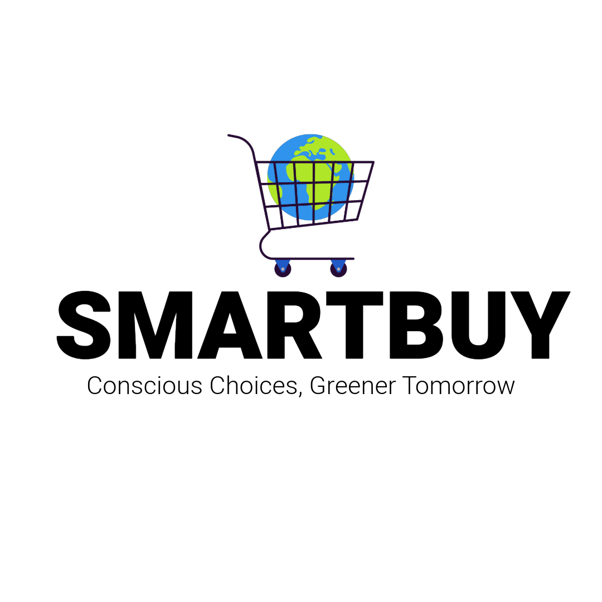

<!-- Logo -->
<br />
<div align="center">
  <a href="https://github.com/zibodsun/BravoTeam">
    
  </a>

  <h3 align="center">A Virtual Reality application for climate change education</h3>

  <p align="center">
    <br />
    <a href="https://github.com/zibodsun/BravoTeam"><strong>Explore the docs »</strong></a>
    <br />
    <br />
    <a href="https://github.com/zibodsun/BravoTeam">View Demo</a>
    ·
    <a href="https://github.com/zibodsun/BravoTeam/issues">Report Bug</a>
    ·
    <a href="https://github.com/zibodsun/BravoTeam/issues">Request Feature</a>
  </p>
</div>

<!-- Table of Contents -->
<details>
  <summary>Table of Contents</summary>
  <ol>
    <li>
      <a href="#smartbuy---conscious-choices-greener-tomorrow">About The Project</a>
      <ul>
        <li><a href="#built-with">Built With</a></li>
      </ul>
    </li>
    <li>
      <a href="#getting-started">Getting Started</a>
      <ul>
        <li><a href="#dependencies">Dependencies</a></li>
        <li><a href="#installation---unity-project">Installation - Unity Project</a></li>
        <li><a href="#installation---application-only">Installation - Application Only</a></li>
      </ul>
    </li>
    <li><a href="#contributing">Contributing</a></li>
    <li><a href="#contact">Contact</a></li>
    <li><a href="#acknowledgments">Acknowledgments</a></li>
  </ol>
</details>

<!---->
# SmartBuy - Conscious choices, Greener tomorrow

We developed this grocery shopping simulation with the goal of spreading more awareness about bad practices in the production of common shopping items, which cause negative environmental effects. We aim to provide facts about the production process of some products/ingredients in a memorable way, and offer the user the ability to make more conscious decisions in their consumer behaviour.

### Built With

* [Unity](https://unity.com/)

## Getting Started

### Dependencies

* Developed for Meta Quest devices.
* Tested on Meta Quest 3.
* Unity 2022.3.11 with Android Support

### Installation - Unity Project

1. Set up the [Android Environment](https://docs.unity3d.com/Manual/android-sdksetup.html)
2. Clone the repo
   ```sh
   git clone https://github.com/zibodsun/BravoTeam
   ```
3. Open the project using Unity Hub

### Installation - Application Only

1. Simply download the .apk build and sideload onto device.

## Contributing

We welcome developers to add their own feature in the form of a new product to go on the shelves. If you have a contribution that would make this better, please fork the repo and create a pull request.

1. Fork the Project
2. Create your Feature Branch (`git checkout -b feature/AmazingFeature`)
3. Commit your Changes (`git commit -m 'Add some AmazingFeature'`)
4. Push to the Branch (`git push origin feature/AmazingFeature`)
5. Open a Pull Request

## Contact

This application was developed by students from Swansea University as a part of the EG-M126 module.

* Natasza: 2021200@swansea.ac.uk
* Zibo: 2357888@swansea.ac.uk

## Acknowledgments
### Credits to used assets
* https://assetstore.unity.com/packages/3d/vegetation/plants/exaggerated-and-unique-foliage-145037
*	https://assetstore.unity.com/packages/3d/vegetation/trees/yughues-free-palm-trees-13540
*	https://assetstore.unity.com/packages/3d/vegetation/trees/palm-tree-pack-free-214483
*	https://assetstore.unity.com/packages/3d/vegetation/trees/coconut-palm-tree-pack-7888
*	https://assetstore.unity.com/packages/3d/props/petrol-chainsaw-74889
*	https://assetstore.unity.com/packages/3d/vegetation/trees/dream-forest-tree-105297
*	https://polygone.art/#page=Model&guid=4j90KAnU9lw
*	https://pixabay.com/sound-effects/
*	https://freesound.org/people/Timbre/sounds/686479/
*	https://www.turbosquid.com/3d-models/3d-model-3d-supermarket-shelves-collection-1992213
*	https://clipartpng.com/?2890,tree-png-clip-art
*	https://pngtree.com/so/happy-gorilla-vector
*	https://polygone.art/#page=Model&guid=8ciDd9k8wha
*	https://assetstore.unity.com/packages/vfx/particles/fire-explosions/free-stylized-smoke-effects-pack-226406
*	https://github.com/microsoft/Microsoft-Rocketbox
*	https://polygone.art/#page=Model&guid=9Ptsg_xZt6B
•	https://assetstore.unity.com/packages/3d/props/tools/survival-kit-lite-92549

